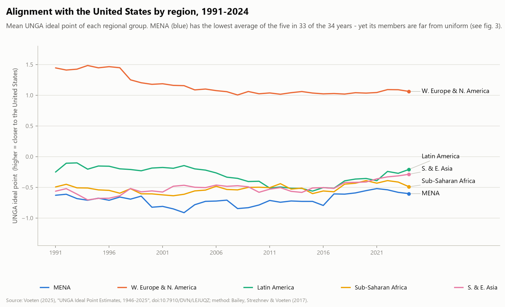
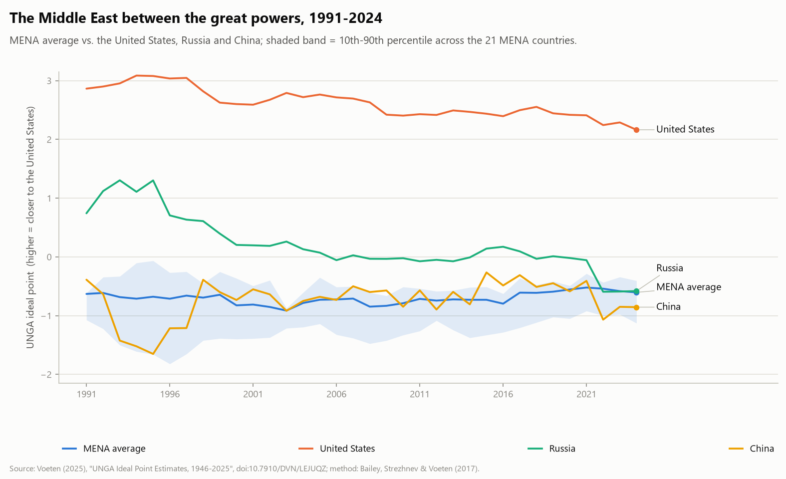
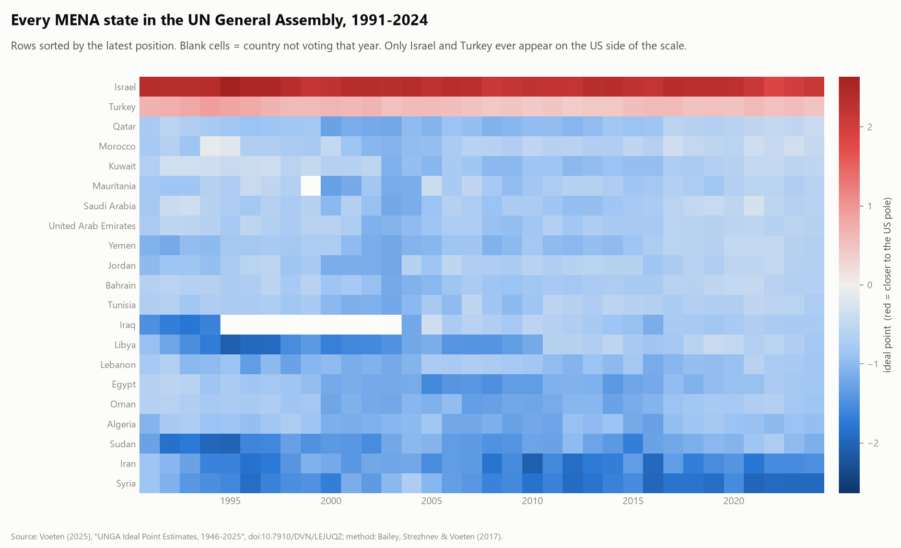
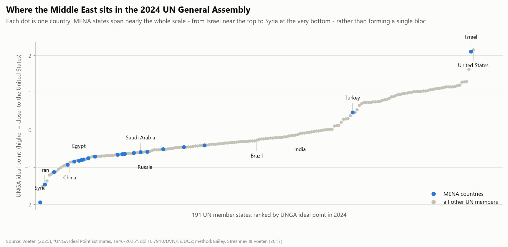
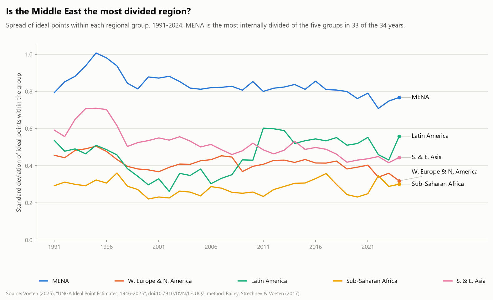

# The Middle East in the UN General Assembly, 1991–2024

**A reproducible descriptive analysis of UNGA ideal point estimates.**

---

### Headline finding

In 2024, the Middle East contained both the **least US-aligned state in the world**
(Syria, rank 1 of 191) and the **second most US-aligned state** (Israel, rank 190 of 191,
behind only the United States itself). MENA is also the **most internally divided region**
of the five regional groups compared here — in 33 of the 34 years covered.

The region is not a bloc. 
This is the finding this repository documents.
---

## Figures

**1. Alignment with the United States by region, 1991–2024**



**2. The Middle East between the great powers**



**3. Every MENA state, year by year**



**4. The 2024 snapshot, all 191 voting members ranked**



**5. Which region is the most divided?**



---

## Key findings

1. **MENA has the lowest average alignment with the US of the five groups** compared
   (Western Europe & North America, Latin America & Caribbean, Sub-Saharan Africa,
   South & East Asia) — in 33 of 34 years (fig. 1).
2. **The regional average hides a bimodal region.** In 2024 Syria is the least US-aligned
   state among all 191 voting members, while Israel is the second most aligned; Turkey is
   the only other MENA state on the US side of the scale (figs. 3–4).
3. **MENA is the most internally divided region** in 33 of 34 years (std. dev. 0.77 in 2024,
   vs. 0.30 in Sub-Saharan Africa) (fig. 5).
4. **The Middle East sits closer to the Russia–China cluster than to the US, but the
   region is wider than the gap between the great powers themselves** — the 10th–90th
   percentile band of MENA states averages 0.85 scale points wide (up to 1.6), while
   Russia and China end 2024 only 0.27 points apart (fig. 2).
5. **Russia's position moved from the US side toward the China cluster** between 1991
   and 2024 (from about +1.3 to −0.6), tracking the post-2022 realignment (fig. 2).

## Data

- **Source**: Voeten, Erik. "United Nations General Assembly Ideal Point Estimates,
  1946–2025." Harvard Dataverse, `doi:10.7910/DVN/LEJUQZ` (V39, July 2025).
- **Method**: Bailey, Michael A., Anton Strezhnev, and Erik Voeten. "Estimating Dynamic
  State Preferences from United Nations Voting Data." *Journal of Conflict Resolution*
  61(2), 2017: 430–456.
- Estimates are country-year posterior means from a Bayesian IRT model with a random-walk
  prior. **Higher values = positions closer to the United States and Western democracies**;
  lower values = closer to the developing-world consensus.
- The pipeline downloads the file directly from the Dataverse API and verifies it against
  the md5 checksum published by Dataverse (`src/01_download.py`).

## Analysis choices

- **Period**: 1991–2024 (post-Cold War; avoids the German and Yemeni unification breaks).
- **2025 is excluded on purpose.** The data provider warns that 2024–25 voting turned
  two-dimensional (Gaza and Ukraine emergency sessions), and the 2025 file aggregates
  191 roll-call votes against a normal session's ~100 — the single-dimension estimates are
  not comparable. Change `END_YEAR` in `src/02_clean.py` to include it.
- **Regional groups** (21 MENA states; 5 comparison groups) follow conventional World Bank
  groupings and are defined in `src/02_clean.py`. They are analytical choices, not facts
  about the world — all figures can be regenerated with different groupings.

## Reproduce

```bash
python -m venv .venv
source .venv/Scripts/activate        # Windows; .venv/bin/activate on macOS/Linux
pip install -r requirements.txt

python src/01_download.py            # downloads + verifies the raw data (~1.4 MB)
python src/02_clean.py               # filters to 1991-2024, attaches regional groups
python src/03_figures.py             # writes figures/ and output/summary_2024.csv
```

Notes for users in mainland China: PyPI can be slow; add
`-i https://pypi.tuna.tsinghua.edu.cn/simple` to the pip command. The Dataverse download
may also take a few minutes.

## Repository structure

```
├── src/
│   ├── 01_download.py     # Dataverse API download with md5 verification
│   ├── 02_clean.py        # period filter, regional grouping -> data/processed/
│   └── 03_figures.py      # fig1-fig5 + output/summary_2024.csv
├── data/raw/              # downloaded data (not committed; re-fetched by 01)
├── data/processed/        # analysis-ready panel
├── figures/               # five figures used in this README
├── output/summary_2024.csv  # the table behind figure 4 (all 191 countries)
└── requirements.txt
```

## Limitations

- Ideal points are **estimates**: each country-year carries a posterior interval
  (`Q5%FP`–`Q95%FP` in the raw file). Small differences between countries should not be
  over-read; the pipeline keeps the quantiles in `data/processed/` for this reason.
- The single dimension summarises *voting behaviour in the General Assembly*, not
  bilateral relations, alliances, or foreign policy in general.
- Group averages weight every member equally; they are not population- or power-weighted.

## Author

Yijin Wang — niki2675612895@gmail.com · Code licensed MIT (see `LICENSE`).
Data are redistributed here only as derived aggregates; see the Dataverse page for the
data's own terms.
